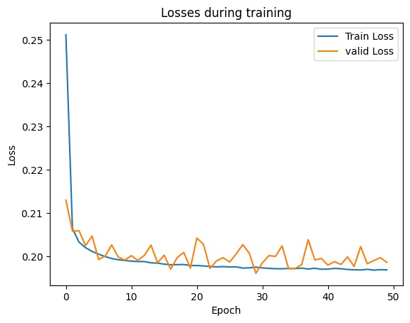

# Data Shape
|    |Train|Valid|Test|
| ---- | ---- | ---- | ---- |
|Block|70000|30000|475061|
|Dataset|664910|285232|4504846|

# Init Loss
|Train Loss|Valid Loss|
| ---- | ---- |
|3.553039|3.552994|

# Train Loss

# Result
| Precision | Recall   | F1       |
|-----------|----------|----------|
| 0.865440  | 0.726511 | 0.789914 |